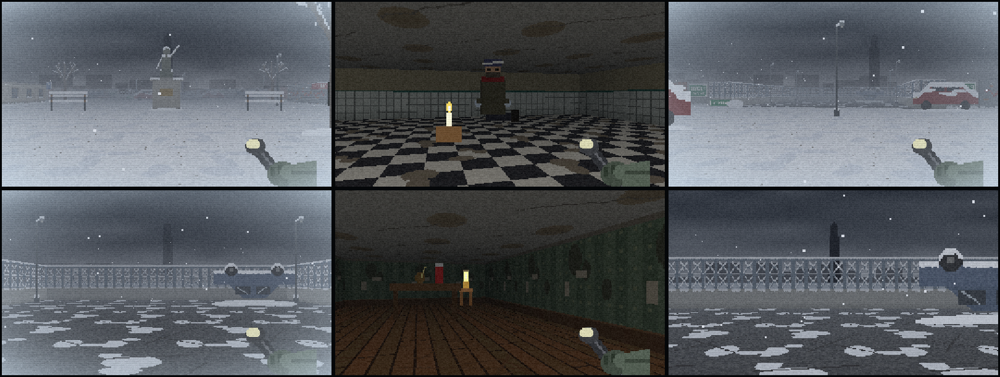

# El Eternauta: Vientos de Octubre — Beta jugable

Beta del prólogo para sacar capturas y evidencias del juego funcionando.
Gráficos estilo **Doom**: "juego 2D con representación en primera persona" (Etapa 11, wireframe 02),
dibujado en baja resolución (200 líneas) y agrandado con píxeles duros.

Todo está en `Assets/EternautaBeta/`. No toca los scripts que ya estaban en `Assets/Scripts/`.



---

## 1. Cómo abrirla y jugar

1. Abrí **Unity Hub → Add → Add project from disk** y elegí la carpeta del proyecto
   (la misma del repositorio). Usá la versión de Unity del proyecto: **6000.6.0f1**.
2. La primera vez Unity tarda unos minutos en importar. Al terminar se abre sola la escena
   `Assets/EternautaBeta/Scenes/Eternauta_Beta.unity`.
3. Apretá **Play**, o usá el menú de arriba **Eternauta → Jugar beta**.

Si la escena no aparece o se rompió: **Eternauta → Crear escena Beta (reparar)**.

Recomendado para capturas: en la pestaña **Game** elegí la resolución **1920x1080** (Full HD) y
activá **Maximize On Play** (o "Play Maximized").

### Controles

| Acción | Tecla |
|---|---|
| Moverse | W A S D |
| Girar | Mouse o flechas ← → |
| Correr | Shift |
| Interactuar / recoger / hablar / abrir puertas | E |
| Inventario | Tab o I |
| Pausa | Esc o P |
| Elegir en un diálogo | 1 / 2 |
| Menús | W/S o flechas + Enter, o el mouse |

## 2. Recorrido de la demo (10 a 15 minutos)

Mapa cerrado de Avellaneda: **Refugio → Plaza Alsina → Casa abandonada → Almacén → Av. Mitre → Puente Pueyrredón**.

1. **Armar el traje aislante**: juntá 2 materiales en el refugio (taller y dormitorio) y usá la mesa de trabajo.
   Sin traje, la puerta del refugio no se abre ("Afuera la nieve mata").
2. **Buscar comida en la casa abandonada** (lado oeste de la plaza). Ahí también está la **radio antigua**.
3. **Hablar con el sobreviviente** (el Informante, en el almacén del lado este). Tiene una **decisión**:
   darle un medicamento (te da el Mapa de Avellaneda) o guardarlo.
4. **Llegar al Puente Pueyrredón** por la Av. Mitre. Al llegar empieza la **secuencia final**: el protagonista
   mira el **Obelisco** a lo lejos, fundido a negro, "FIN DEL PRÓLOGO", y créditos.

Supervivencia: a la intemperie la nieve baja la salud (los bordes de la pantalla se congelan). Bajo techo
se deja de perder salud y se recupera hasta un 30 %. Medicamentos y comida se usan desde el inventario.
No hay Game Over (Etapa 12, lámina 6B).

La partida se **guarda sola** al completar cada objetivo. **CONTINUAR** del menú carga ese guardado.

## 3. Cómo sacar capturas

| Tecla | Qué hace |
|---|---|
| **F12** | Guarda una captura PNG con la interfaz incluida |
| **F11** | Modo foto: oculta HUD, mensajes y la mano (capturas limpias del escenario) |
| **F9** | Modo desarrollador (ver abajo) |

Las capturas quedan en la carpeta **`Capturas/`** del proyecto (al lado de `Assets/`). En el juego compilado,
en `Capturas/` al lado del .exe. Atajo: **Eternauta → Abrir carpeta de capturas**.
El nombre incluye fecha, hora y zona, por ejemplo `eternauta_20261009_143012_plaza_alsina.png`.

### Modo desarrollador (Etapa 5: rol Desarrollador / Tester interno)

Se activa con **F9** durante una partida. Muestra FPS, posición, zona, salud y objetivo, y habilita:

| Tecla | Qué hace |
|---|---|
| F2 | Invulnerable |
| F3 | Completar el objetivo actual |
| F4 | Ir a la siguiente "postal" (lugares preparados para capturas: refugio, taller, plaza, casa abandonada, almacén, avenida, entrada al puente, puente) |
| F5 | +1 de cada recurso (para mostrar el inventario lleno) |
| F6 | Cambiar la salud: 100 → 25 → 0 (para los 3 estados del HUD) |
| F7 | Saltar al puente para ver el final |
| F8 | Activar / desactivar el efecto VHS |

## 4. Guía de evidencias

Qué capturar para cada requerimiento (Etapa 6), historia de usuario (Etapa 8) y pantalla (Etapas 11 y 12):

| Evidencia | Cómo conseguirla |
|---|---|
| Menú principal (lám. 8) | Al iniciar. CONTINUAR aparece deshabilitado si no hay partida guardada (lám. 5B, estado 4) |
| Botón seleccionado / presionado (lám. 5B) | Pasar el mouse sobre un botón / mantener el clic apretado y apretar F12 |
| Confirmación de nueva partida (lám. 8B C) | NUEVA PARTIDA cuando ya hay un guardado |
| Opciones (lám. 8C) | Menú → OPCIONES |
| Créditos (lám. 8D) | Menú → CRÉDITOS |
| RF01 / HU01 Movimiento y exploración | Caminando por la plaza o la avenida |
| RF02, RF11 Escenarios de Avellaneda | F4 en modo desarrollador recorre las postales |
| RF03 / HU02 Recolección | Al recoger un objeto aparece "Recogiste: …" |
| RF04 Uso de recursos | Inventario → UTILIZAR sobre un medicamento o comida |
| RF05 Nieve como amenaza | Afuera: bordes congelados y salud bajando. F6 para SALUD BAJA y SALUD 0 (lám. 6B) |
| RF06 / HU03 Interacción con objetos | Mirar un objeto cerca: borde azul punteado + "[E] + INTERACTUAR" (lám. 6C) |
| RF07 / HU04 Personajes | Diálogo con el Informante, con la decisión |
| RF08 / HU05 Objetivos | HUD arriba (punto azul + objetivo) y panel "OBJETIVO ACTUAL" al cambiar de objetivo (wireframe 04, lám. 6D) |
| RF09, RF10 / HU06 Historia y eventos | Radio antigua, salida del refugio, llegada al puente |
| RF12 Interacción con el entorno | Puertas, mesa de trabajo, radio |
| RF13, RF14 / HU07, HU08 Final | Llegar al puente (o F7): Obelisco, "FIN DEL PRÓLOGO", créditos (lám. 8E) |
| HUD responsive (lám. 9C) | Game view en 1920x1080, 1366x768 y 1024x600. En 1024x600 se omite la palabra RECURSOS |
| Inventario (lám. 7, 7B, 7C) | Tab. Categoría vacía: "No hay objetos disponibles." Objeto no utilizable: UTILIZAR punteado |
| Pausa y confirmación (lám. 7, wireframes 05 y 06) | Esc → VOLVER AL MENÚ |
| Modelo de datos y persistencia (Etapas 13 y 14) | El archivo `eternauta_partida.json` (ver abajo) |
| Herramientas de tester (Etapa 5) | Captura con el panel de F9 abierto |

## 5. Partida guardada (JSON)

Se guarda en `Application.persistentDataPath/eternauta_partida.json`. En Windows:

```
C:\Users\<usuario>\AppData\LocalLow\DefaultCompany\El Eternauta Vientos de Octubre\eternauta_partida.json
```

Atajo: **Eternauta → Abrir carpeta de la partida guardada**. Los campos siguen la Etapa 13:
jugador, partida (fecha, progreso, vida, escenario actual), inventario (`id_recurso`, `cantidad`),
objetivos (`id_objetivo`, `estado`) y eventos (`id_evento`, `activado`), más lo necesario para retomar
(posición, traje, objetos recogidos, puertas abiertas). **Eternauta → Borrar partida guardada** la elimina.

## 6. Compilar un .exe

**File → Build Profiles → Windows → Build**. La escena `Eternauta_Beta` ya está primera en la lista.
En el .exe, OPCIONES sí cambia la resolución y la pantalla completa (en el Editor se cambian desde la pestaña Game).

## 7. Cómo está hecho (Etapa 14)

```
Assets/EternautaBeta/
  Scenes/Eternauta_Beta.unity   escena (cámara + objeto EternautaGame)
  Scripts/Core/                 EternautaGame (bucle y estados), Entrada (teclado/mouse)
  Scripts/Data/                 ContenidoJuego (contenido fijo: mapa, objetivos, diálogos, recursos)
                                PartidaGuardada (estado de partida en JSON)
  Scripts/Logic/                Jugador, Inventario, Progresion (objetivos y eventos)
  Scripts/Render/               Raycaster (motor estilo Doom), ArteProcedural (texturas y sprites)
  Scripts/World/                Mundo (grilla del mapa, puertas, objetos)
  Scripts/UI/                   Menús, HUD, inventario, opciones, créditos, final (Etapa 12)
  Scripts/Audio/                Viento, pasos, radio, latidos (sonidos generados por código)
  Scripts/Tools/                Capturas (F12)
  Editor/                       Menú "Eternauta" de Unity
```

- **Presentación**: `UI/`, `Render/`. **Lógica**: `Logic/`, `World/`. **Datos**: `Data/`.
- Todas las texturas, sprites y sonidos se generan por código: no hace falta importar arte.
- Para cambiar textos, créditos, objetivos o el mapa: `Scripts/Data/ContenidoJuego.cs` (el mapa es una
  grilla de caracteres con la leyenda explicada ahí mismo).
- La interfaz usa la paleta, tipografías (Arial Narrow / Arial), tamaños y estados de botones de la Etapa 12,
  sobre una referencia de 1920x1080 que escala con la pantalla.

**Fuera de la beta** (igual que en el MVP de la Etapa 4): combate, mundo abierto, misiones secundarias y multijugador.
